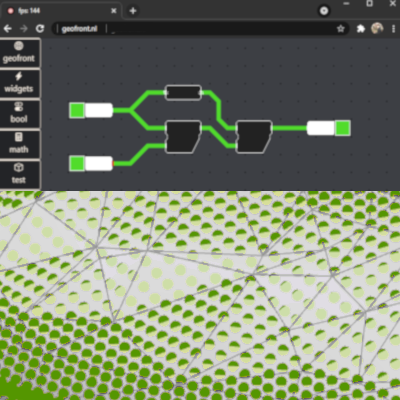

# Client-side geo-processing using WebAssembly and Visual Programming.

|       |                        |
|------ | ---------------------  |
| name  | Jos Feenstra           | 
| nr    | 4465768                |
| email | feenstrajos@gmail.com  | 
| date  | 15-09-2021             | 

Within the domain of Geomatics, geodata experts often would like to take some geo-dataset, and process it for a specific use case. 
This "geoprocessing" is most often done natively on a desktop by using a library like `CGAL` or a tool like `QGis`. 
On the web, Geoprocessing Services exist like the `Google Earth Engine`, which offer server-side geoprocessing.

The aim of this research will be to explore a new geoprocessing method: geoprocessing in a browser, client-side. 
This would be beneficial for several reasons. 
For one thing, it would make geoprocessing tools extremely accessible. 
Users would not have to install anything besides a web browser, and geodata experts can share tools without having to download or build anything. 
Secondly, client-side geoprocessing can make geoprocessing more interactive and insightful. A 'sandbox environment' which can do geodata _retrieval_, _processing_, and _visualization_ in a web browser would be a great tool for debugging, quickly looking at the effects of parameters, finding out which algorithms work best with which dataset, etc. 

This research attempts to solve two big barriers preventing successful client-side geoprocessing.
The first barrier is that the client-side programming language `javascript`, together with its library ecosystem, do not offer the speed nor the tools to perform fast geoprocessing.  
To solve this, WebAssembly will be considered. 
WebAssembly is a type of binary that runs in web browsers. 
It can be used to take an existing C++ geoprocessing library (like cgal), and to publish it in a way anyone with a browser can run it at near native speed. 

The second barrier is that an application using 'just WebAssembly' will not be useful enough to make client-side geoprocessing a good alternative to regular geoprocessing. 
Client-side geoprocessing will eventually require some sort of framework to work within, just like many geoprocessing tools eventually become `QGIS` plugins. This thesis will consider a framework in the form of a web-based Visual Programming Language, or VPL to facilitate this.
The research aims to analyse similar geo-vpl's like Save Software's `FME`, McNeel's `Grasshopper` and Ravi Peter's `GeoFlow` in order learn from them. 

_Supervisors: Ken Arroyo Ohori + Stelios Vitalis_

<!-- WebAssembly [...] became a World Wide Web Consortium recommendation on 5 December 2019,[11] alongside HTML, CSS, and JavaScript.[12] -->

<!-- A web application like this poses several technical challenges. This research aims to not only define these challenges and offer solutions, but to also implement said solutions and put them to the test. The two main challenges are that  -->

<!-- 
These ways of geoprocessing, however, fail to meet the demands of many geodata users. 

near impossible to access by non geodata experts. 

- command line libraries -> no insight, no visuals, many parameters are guesswork
- QGis -> not always easy to work with ( you can make a career out of being good at Qgis)
- arcgis -> closed system
- server-side -> again no insight, often not even a "progress bar". -->

# Reduced

The aim of this research is to explore a new geoprocessing method: geoprocessing in a browser, client-side. 
This would be beneficial for several reasons. 
For one thing, users would not have to install anything besides a web browser. This way, tools can be shared, cross-platorm, without having to download or build anything. 
Secondly, client-side geoprocessing can make geoprocessing more interactive and insightful. A 'sandbox environment' which can do geodata _retrieval_, _processing_, and _visualization_ from a web browser would be a great tool for debugging, quickly looking at the effects of parameters, and finding out which algorithms work best with which dataset.

This research attempts to solve two barriers preventing successful client-side geoprocessing. The first barrier is that the client-side programming language `javascript`, together with its library ecosystem, do not offer the speed nor the tools to perform fast geoprocessing. To solve this, WebAssembly, a type of binary that runs in virtual machines, will be considered. It can be used to take an existing C++ geoprocessing library (like _cgal_), and to publish it in a way anyone with a browser can run it at near native speed. 

The second barrier is that an application using 'just WebAssembly' will not be very useful or insightful without a sufficient framework supporting it. This thesis will consider a framework in the form of a web-based Visual Programming Language, or VPL to facilitate this. 
