--- 
# <!------------------------------ [ Header ] ---------------------------------->
marp: true
author: Jos Feenstra
theme: default 
paginate: true
inlineSVG: true
backgroundImage: url('./images/hero-white.png')
---

<!------------------------------- [ Body ] ----------------------------------->

<!-- 
_class: lead 
_backgroundColor: black
-->

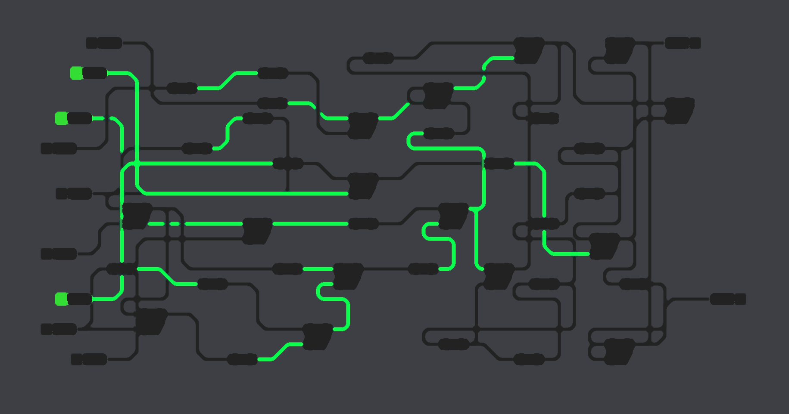

# <!-- fit --> Thesis Proposal: 

# Accessible geoprocessing in the browser using WebAssembly & Visual Programming

### Msc Geomatics for the Built Environment

<!-- 
Thank you for coming!

- First of all, André, thank you 
-->

-----------------------------------------------------------------------------------

<!-- _class: invert-->

#### <!-- fit -->_Thesis Proposal : Accessible geoprocessing in the browser using WebAssembly & Visual Programming_

#### MSc Geomatics for the Built Environment 

#### January 28, 2022 @ TU Delft Faculty of Architecture, Room U

###### Proposer: Jos Feenstra
###### First supervisor  : Stelios Vitalis
###### Second supervisor : Ken Arroyo Ohori
###### External Examiner : André Mulder

-----------------------------------------------------------------------------------

### Chapters:

## 1. Introduction
## 2. This Study
## 3. Methodology 
## 4. Preliminary Results

<!-- 
- I will quickly introduce what 'Client-side Geoprocessing' exactly means and **Why** it motivates this study 

- We can then go into **What** specifically this study seeks out to do, and how this relates to what already has been done.  

- And after that, **How** this study will be carried out.

- 
 -->

-----------------------------------------------------------------------------------

# <!-- fit --> 1. Introduction

-----------------------------------------------------------------------------------

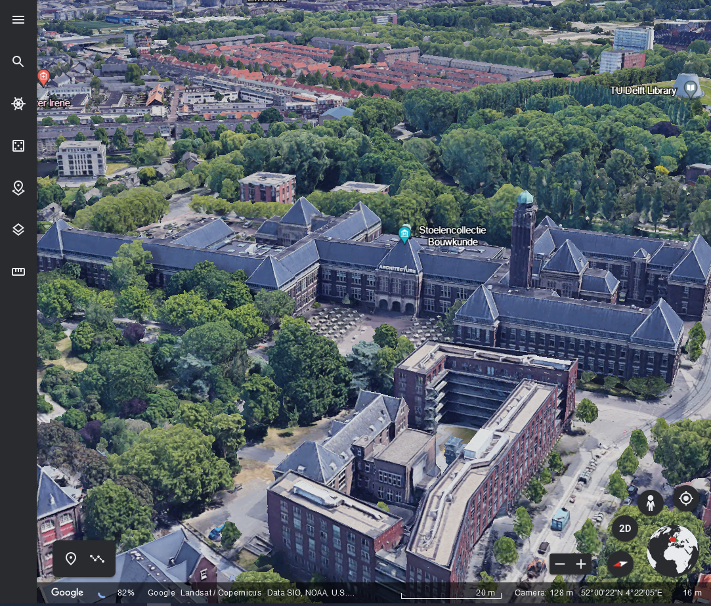

# Geographical Web Applications

- Type of GIS
- Important Component of Geo Informatics
- Often first and only experience of GIS for the general public.
- Extremely accessible
- Easy to update & maintain

-----------------------------------------------------------------------------------

# Geographical Web Applications

Examples
- Google Maps
- Open Street Map
- PDOK viewer

# Focus: _Looking_ at geodata

<!-- 
Central to this study is the geographical Web Application.
Geo web apps are unmistakingly tied to geo-informatics

Examples: 
- Google Maps 
- Open Street Map 
- Pdok Viewer

 -->

-----------------------------------------------------------------------------------

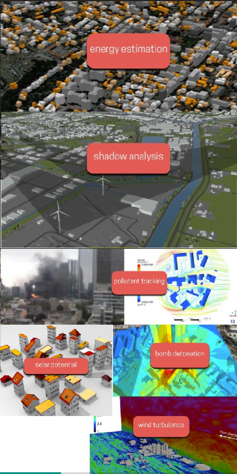

# Next: _Using_ Geodata

<!-- 
The next thing a 

small subset of the general public 

might want to do

not only view 

use or analyse 

it for a variety of purposes.
-->

- Who? Data Users
    - Scientists, analysts, architects, urban planners, municipalities
  <!-- Any non-geodata expert who still would like to _use_ geographical information and data -->
- Simple queries
  <!--"Visualize all roads of a city < 50kmh" -->  
- Advanced queries
  <!-- solar potential, noise propagation, Viewshed & Shadow analysis. -->
- Involves Processing & analyzing geodata 
<!-- This is important: the geodata will need to be altered in some sense -->

----------------------------------------------------------------------------------

# Possible, but not using geo web apps...
<!-- 
It is here where geographical web applications show their limitations
 -->

- Only viewers
<!-- - No processing or analysis tools  -->
- Very limited Geoprocessing or analysis
<!--  -->

- Data users are left to their own devices. <!-- They have a couple of options: -->
    - Make jump to specialist GIS software
    <!-- 
    Having to make the jump to specialist GIS software E
    But that is quite a big jump for most people. 
    Most people do not have the time to do such a thing 
    -->
    - Use something known (CAD / modelling)
    - ~~Tracing Google Maps Screenshots~~
<!-- 
It is here where geo web apps show their limitations

- even for a simple, small query, geo web applications are often not able to be of service.  

- No way to post process, or edit the geodata 

This brings us to the central idea of this study:

-->

-----------------------------------------------------------------------------------

<!-- _class: invert -->

# <!-- fit --> The Idea: Geodata Processing _within_ a browser

<!-- Accessible and Sharable -->

-----------------------------------------------------------------------------------

# Browser-based Geoprocessing

<!-- This idea is not new, and exists, and is called -->

- or Client-side Geoprocessing (CSG)
<!--  -->
- Relatively unknown, but gaining traction.
<!-- Multiple studies, In academic communities, over the last 5 years -->
- Potential of accessible and sharable processing tools 
<!-- Available to a more diverse group of users than just Geodata experts -->

-----------------------------------------------------------------------------------

<!-- _class: invert -->

# _"But, why is client-side geoprocessing as of yet still nowhere to be found?"_

-----------------------------------------------------------------------------------

#  Obstacles 

<!-- Obstacles can be identified by analysing the previous works on Client-side geoprocessing. -->

1. CSG is technically challenging
<!-- Javascript  -->

2. CSG is underdeveloped
<!-- No  -->

3. CSG is overshadowed by other technologies
<!-- No  -->

<!-- I am required to go in-depth -->

-----------------------------------------------------------------------------------

# **Connected** Obstacles 

1. CSG is technically challenging
<!-- Javascript  -->

2. CSG is underdeveloped
<!-- No  -->

3. CSG is overshadowed by other technologies

-----------------------------------------------------------------------------------

# <!-- fit --> 2. This Study

-----------------------------------------------------------------------------------

# Aim

- _Actualizing_ client-side geoprocessing
<!-- CSG has a valid theoretical framework, and a lot of potential. 

<!-- Shape the methodology to adress key issues

remaining : practical, actualization  -->
- Methodology:
    - Practical
     <!-- Focus: studying and solving practical inhibitions  -->
    - Wholistic
    <!-- Not one, but all three inhibitions will be adressed, -->
    - Precise 
    <!--  Solving key components which matter most-->

<!-- CONTINUE: Name exaclty how the obstacles shape the methodology -->

-----------------------------------------------------------------------------------

### First obstacle : CSG is a technical challenge

<!-- One of the reasons: \ -->

<!-- Other reasons: Big Data -->

- JavaScript is not performant
- No mature geoprocessing libraries available client-side

### **Methodology : Research if WebAssembly can be used to compile existing geoprocessing libraries.**

<!-- - How to make the libraries compile?
- Is the performance similar?
- How large will the compiled libraries be? -->

-----------------------------------------------------------------------------------

### Second Obstacle : CSG is immature

- Little to no supporting software
- no noteworthy examples
<!-- - The way geoprocessing is supposed to be a web application is unknown -->

### **Methodology : Develop a use-case application to support the research and to serve as example for future research**.

-----------------------------------------------------------------------------------

### Third Obstacle : CSG is considered unnecessary

- overshadowed by native & server side geoprocessing

### **Methodology : Develop a use-case application to demonstrate the situational advantages of client-side geoprocessing**

-----------------------------------------------------------------------------------

### Central Question:

# _"How to design and create a browser-based GIS environment which can effectively utilize existing geoprocessing libraries, using only the current state of standard client-side technologies"_

<!-- _class: invert -->

-----------------------------------------------------------------------------------

_"How to design and create a browser-based GIS environment which can **effectively utilize** existing geoprocessing libraries, using only the current state of **standard client-side technologies**"_

<!-- - **Effectively utilize**  -->
<!-- The study intends to not only find out how \ac{wagl}'s can be \textit{run} in a browser, but also how \ac{wagl}'s can be \textit{used}. 
'Effective' is used in the wholistic sense, since a balance will have to be found between several aspects such as load-time, run-time, and less concrete usability aspects.  -->

<!-- - **Standard client-side web technologies** -->
<!-- This phrase is meant to limit the scope to only the standard, core technologies of major browsers (Chrome, Edge, Safari, Firefox). This means the four languages \ac{wasm}, CSS, JavaScript and HTML. Additionally, HTML5 gives us WebGl, the 2d Canvas API, SVG's, and Web Components to work with. -->

-----------------------------------------------------------------------------------

### Sub Questions

<!-- To capture the key components from the three obstacles -->

### _1. What is the most fitting methodology of compiling C++ geoprocessing   libraries to Web-Assembly?_
<!--  First Obstacle -->
### _2. How to design and create a client-side geoprocessing environment for data-users?_
<!--  Second Obstacle -->
### _3. How can wasm-compiled geoprocessing libraries be distributed and used in a client-side geoprocessing environment?_
<!-- First + Second -->
### _4. What are the advantages and disadvantages of GIS applications created using a client-side geoprocessing environment powered by WebAssembly?_
<!--  Third Obstacle -->
-----------------------------------------------------------------------------------

# Use Case : GeoFront

- Web-first GIS
- Offers full geodata analysis procedure
  <!-- - Find, load, transform, and visualize geodata. -->
- Visual Programming Language
  <!-- - Balance between programmers & non-programmers
  - Procedure alterable on the fly
  - Visualize in-between products -->

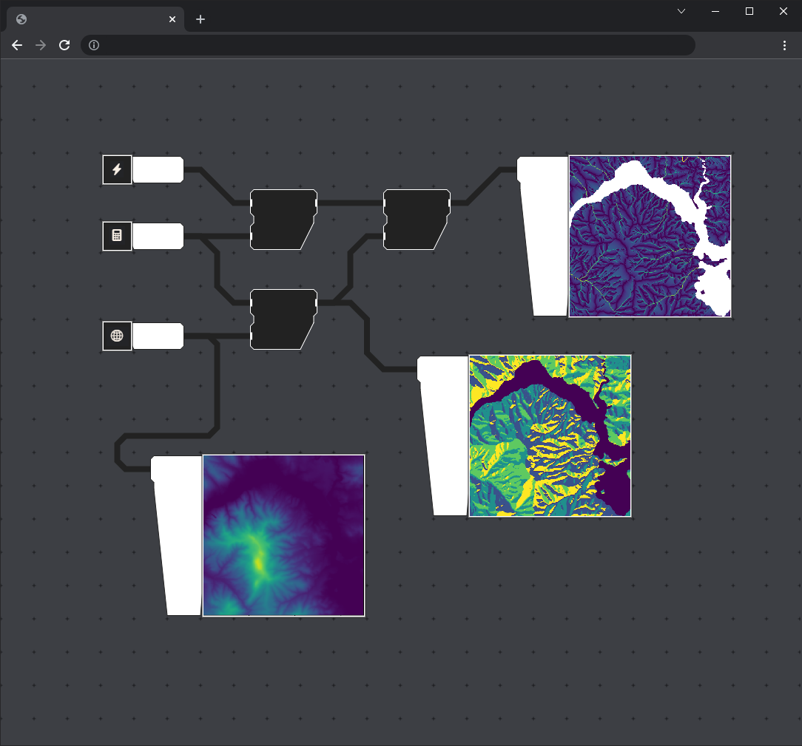

<!-- -----------------------------------------------------------------------------------

# Will not include

- Server-side or native WebAssembly 

- Web Processing Services

- Usability Analysis  -->

-----------------------------------------------------------------------------------

# <!-- fit --> 3. Methodology 

-----------------------------------------------------------------------------------
# Methodology
- Incremental 
<!-- Meaningful in between products -->
- Iterative
<!-- Meaningful in between products -->

### Per phase: 
- Answer sub question
- Develop use-case component

-----------------------------------------------------------------------------------

# Phase 1
- Study WebAssembly capabilities & features
<!--  -->
- Compile C++ libraries to Wasm (GCAL / GDAL)
<!-- Different Methods -->
- Analyse and compare performance.   
<!-- Interested in what the performance drop will entail -->
<!-- Compare to native  -->

-----------------------------------------------------------------------------------

<!-- Will be characterized by development -->

# Phase 2
- Study existing visual geometry processing languages
<!--  -->
- Design & develop a visual language
<!--  -->
- Add necessary features step by step 
<!--  -->

-----------------------------------------------------------------------------------

# Phase 3
- Study code splitting & distribution methods
<!--  -->
- Combine and align the results of phase 1 & 2
<!--  -->
- Reassess the wasm-compiled libraries
<!-- This time judging their 'in the field' performance -->

-----------------------------------------------------------------------------------

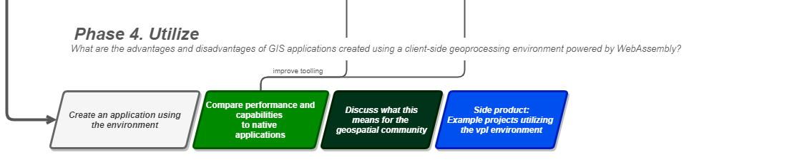

# Phase 4
- Study the environment itself
<!--  -->
- Use it to develop geoprocessing applications
<!--  -->
- Assess its performance and usability
<!--  -->

-----------------------------------------------------------------------------------

# <!-- fit --> 4. Preliminary Results 

<!-- Part of the purpose of these P2 presentations is to give you an impression of the feasibility of this study. 

Within this chapter, I will therefore name not only preliminary results, but all other aspects of how I have been preparing this study -->

-----------------------------------------------------------------------------------

# 1. GeoFront

- First draft of the use-case application
- geofront.nl
- Focus: basics of visual programming

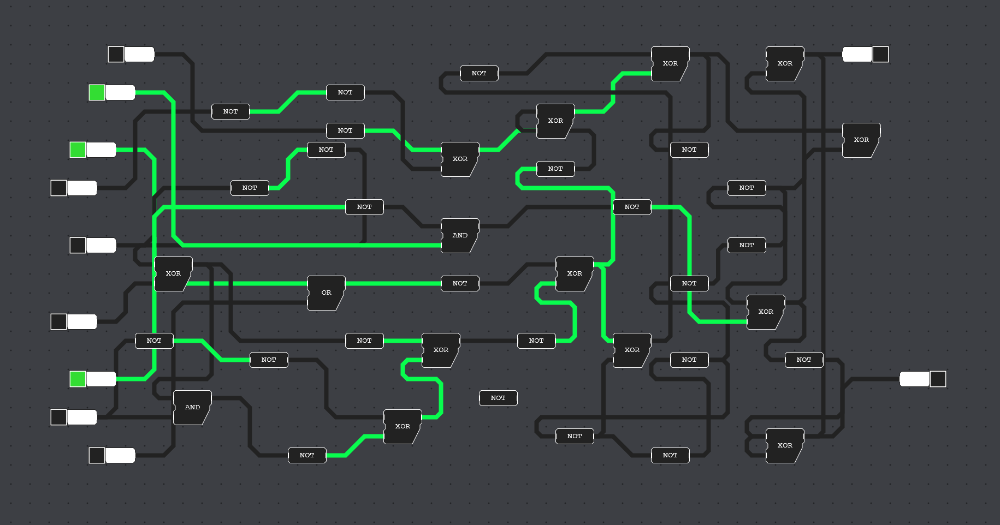 

<!--
Basic types ✔
Javascript interoperability ✔
-->

-----------------------------------------------------------------------------------

 

 

-----------------------------------------------------------------------------------

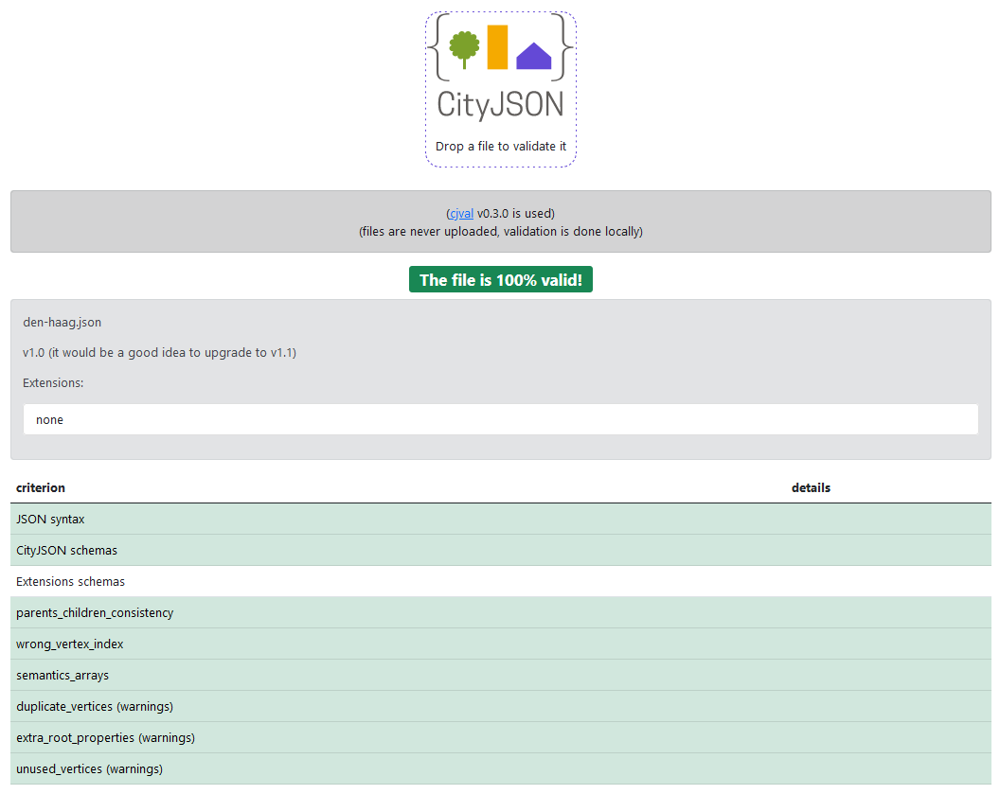

# 2. WebAssembly

- Research assignment
<!--  -->
- Cityjson Validator
<!--  -->
- Rust & Wasm

-----------------------------------------------------------------------------------

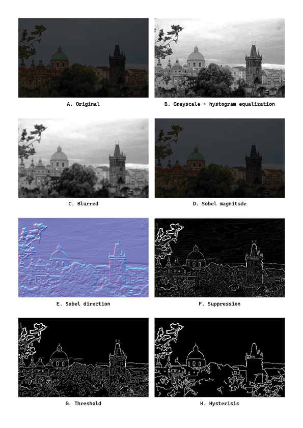
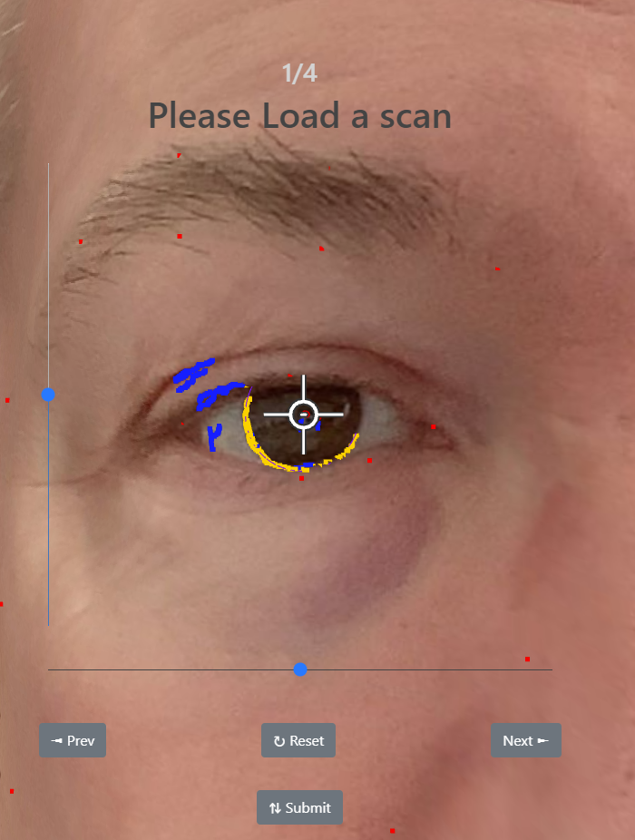

# 3. Internship

- Web (Geo) Data processing
- Image processing 
- Commercial perspective

-----------------------------------------------------------------------------------

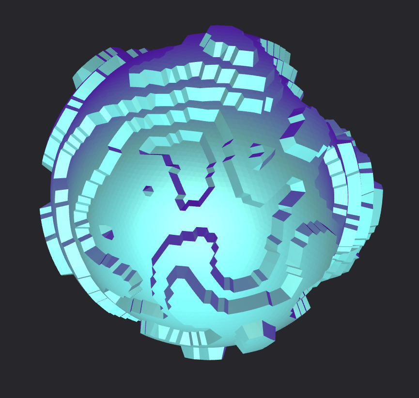

# 4. Geon Engine 

- Personal research project
- Web-based 3D Engine build from first-principles
- 2D and 3D data manipulation  
<!-- 's suitability for linear algebra  -->

-----------------------------------------------------------------------------------

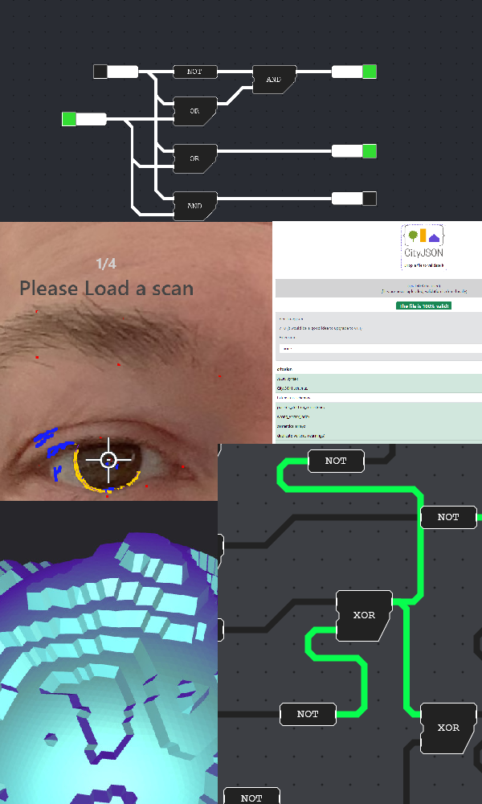
# Taken Together

- Insight in geometry processing on the web
- Insight in WebAssembly as a whole
- A good start for the use case application
<!-- 
Insight in geometry processing on the web

 -->

-----------------------------------------------------------------------------------

<!-- 
_class: lead 
_backgroundColor: black
-->

# <!-- fit --> Lastly, a final word...

<!-- 
This study is personal. 

- Ive seen what 

Give back to the bachelor
 -->

-----------------------------------------------------------------------------------

<!-- 
_class: lead 
_backgroundColor: black
-->

# <!-- fit --> Thank you for your attention!

##### Accessible geoprocessing in the browser using WebAssembly & Visual Programming

###### by [Jos Feenstra](https://josfeenstra.nl)

<!-- ----------------------------------------------------------------------------------- -->

<!-- _class: lead

# Sources -->