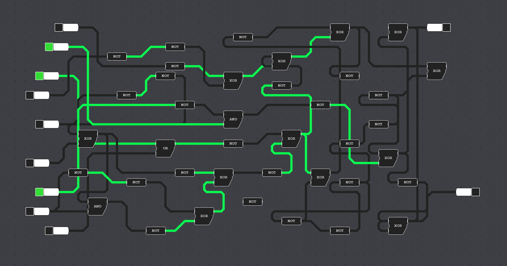

--- 
<!------------------------------ [ Header ] ---------------------------------->
marp: true
author: Jos Feenstra
theme: default 
paginate: true
inlineSVG: true
# backgroundImage: url('https://marp.app/assets/hero-background.jpg')
---

<!------------------------------- [ Body ] ----------------------------------->

<!-- 
_class: lead 
_backgroundColor: black
-->

# <!-- fit --> Thesis Proposal: 

# Accessible geoprocessing in the browser using WebAssembly & Visual Programming

### Msc Geomatics for the Built Environment

<!-- 
Thank you for coming!

Today I wish to share my master thesis proposal with you. 

my Masters thesis for Geomatics for the Built Environment. 

-->

-----------------------------------------------------------------------------------

<!-- _class: invert-->

#### <!-- fit -->_Thesis Proposal : Accessible geoprocessing in the browser using WebAssembly & Visual Programming_

#### MSc Geomatics for the Built Environment 

#### 28 Januari 2022 

###### Proposer: Jos Feenstra | 4465768 | me@josfeenstra.nl
###### First supervisor  : Stelios Vitalis
###### Second supervisor : Ken Arroyo Ohori
###### External Examiner : André Mulder

-----------------------------------------------------------------------------------

## 1. Motivation
## 2. Problem
## 3. The thesis
## 4. Methodology 
## 5. Preliminary Results

-----------------------------------------------------------------------------------
<!--------------------------------- [ 1. Motivation ] ---------------------------->
<!-- 
_class: lead 
_backgroundColor: black
-->

# <!-- fit --> 1. Motivation

-----------------------------------------------------------------------------------

# hallo

-----------------------------------------------------------------------------------
<!--------------------------------- [ 2. Problem ] ------------------------------->
<!-- 
_class: lead 
_backgroundColor: black
-->

# <!-- fit --> 2. Problem

-----------------------------------------------------------------------------------

-----------------------------------------------------------------------------------
<!------------------------------- [ 3. The Thesis ] ------------------------------>
<!-- 
_class: lead 
_backgroundColor: black
-->

# <!-- fit --> 3. The thesis

-----------------------------------------------------------------------------------

-----------------------------------------------------------------------------------
<!--------------------------------- [ 4. Method ] ------------------------------->
<!-- 
_class: lead 
_backgroundColor: black
-->

# <!-- fit --> 4. Methodology 

-----------------------------------------------------------------------------------

-----------------------------------------------------------------------------------
<!--------------------------------- [ 5. Results ] ------------------------------->
<!-- 
_class: lead 
_backgroundColor: black
-->

# <!-- fit --> 5. Preliminary Results 

-----------------------------------------------------------------------------------

-----------------------------------------------------------------------------------

<!-- 
_class: lead 
_backgroundColor: black
-->

# <!-- fit --> Thank you for your attention

##### Accessible geoprocessing in the browser using WebAssembly & Visual Programming

###### by [Jos Feenstra](mailto:josfeenstra.nl)

-----------------------------------------------------------------------------------

<!-- _class: lead -->

# Sources