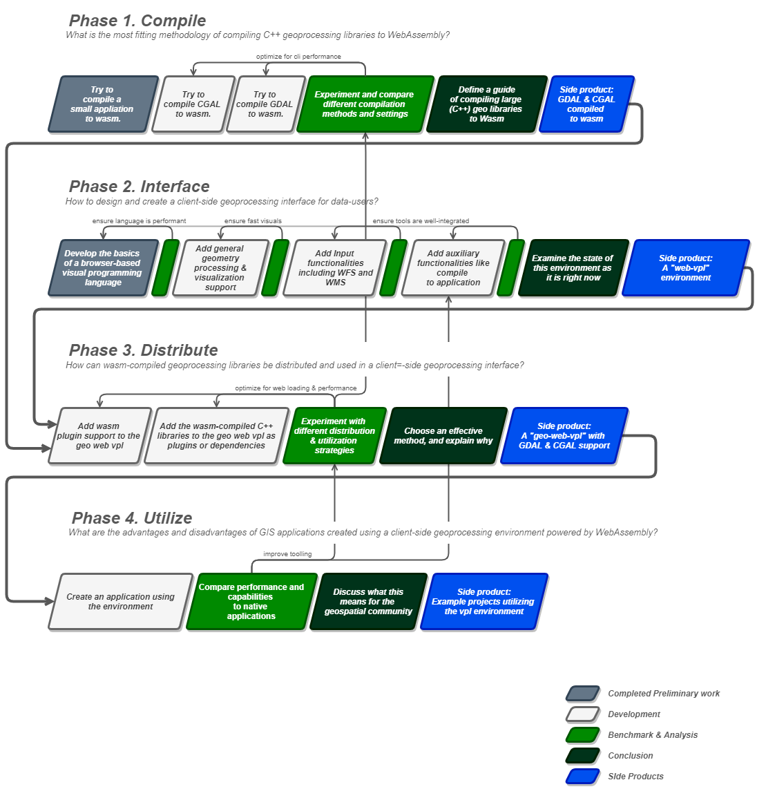

--- 
# <!------------------------------ [ Header ] ---------------------------------->
marp: true
author: Jos Feenstra
theme: default 
paginate: true
inlineSVG: true
backgroundImage: url('./images/hero-white.png')
---

<!------------------------------- [ Body ] ----------------------------------->

<!-- 
_class: lead 
_backgroundColor: black
-->

# <!-- fit --> Thesis: Peiling 3: Midterm Evaluation

# Accessible geoprocessing in the browser using WebAssembly & Visual Programming

### Msc Geomatics for the Built Environment

-----------------------------------------------------------------------------------

<!-- _class: invert-->

#### <!-- fit --> Thesis: P3 Midterm Evaluation.

#### MSc Geomatics for the Built Environment 

#### [January 28, 2022 @ TU Delft Faculty of Architecture, Room U](https://tudelft.zoom.us/j/99384770684?pwd=d05ZRTBoOWRuak53elVTODBNNHdKZz09)

###### Author: Jos Feenstra
###### First supervisor  : Stelios Vitalis
###### Second supervisor : Ken Arroyo Ohori

-----------------------------------------------------------------------------------

### Content

## 1. Recap P2 Methodology
## 2. Progress report
## 3. How to continue

-----------------------------------------------------------------------------------

# <!-- fit --> 1. Recap P2 Methodology 

-----------------------------------------------------------------------------------
# Methodology
<!-- - Incremental  -->
<!-- Meaningful in between products -->
<!-- - Iterative -->
<!-- Meaningful in between products -->

### Per phase 2 goals: 
- Answer sub question
- Develop component of use-case

-----------------------------------------------------------------------------------

# Phase 1

##### _What is the most fitting methodology of compiling C++ geoprocessing   libraries to WebAssembly?_

<!-- - Study WebAssembly capabilities & features -->
<!--  -->
<!-- - Compile C++ libraries to Wasm (GCAL / GDAL) -->
<!-- Different Methods -->
<!-- - Analyse and compare performance.    -->
<!-- Interested in what the performance drop will entail -->
<!-- Compare to native  -->

-----------------------------------------------------------------------------------

# Phase 2
<!-- Will be characterized by development -->
##### _How to design and create a client-side geoprocessing environment for data-users?_

<!-- - Study existing visual geometry processing languages -->
<!--  -->
<!-- - Design & develop a visual language -->
<!--  -->
<!-- - Add necessary features step by step  -->
<!--  -->

-----------------------------------------------------------------------------------

# Phase 3

#### _How can wasm-compiled geoprocessing libraries be distributed and used in a client-side geoprocessing environment?_

<!-- - Study code splitting & distribution methods -->
<!--  -->
<!-- - Combine and align the results of phase 1 & 2 -->
<!--  -->
<!-- - Reassess the wasm-compiled libraries -->
<!-- This time judging their 'in the field' performance -->

-----------------------------------------------------------------------------------

# Phase 4
### _What are the advantages and disadvantages of GIS applications created using a client-side geoprocessing environment powered by WebAssembly?_

<!-- - Study the environment itself

- Use it to develop geoprocessing applications

- Assess its performance and usability -->

-----------------------------------------------------------------------------------

# <!-- fit --> 2. Progress Report 

-----------------------------------------------------------------------------------
# Where are we? 

- We are at Week 12, the 7th week into this project
- 6 Weeks of P4 preparation behind us
    - 9 Weeks ahead of us
    - 14 Weeks including the P5 

-----------------------------------------------------------------------------------

# What has been done during those weeks?
Characterized by work on the application itself.

#### Week 1
Flow-graph Improvements (connectivity rework)

#### Week 2 
Application Fundamentals (undo / redo, load / save)

#### Week 3
Plugin system fundamentals (how to turn foreign software projects into graph nodes / how to share types, and make the application typesave)

-----------------------------------------------------------------------------------

#### Week 4
Creating the HTML UI around the application. (solved by using events, HTML templates and Web Components).

#### Week 5
Fixing stability issues

#### Week 6
First steps Geoprocessing 
- reading, writing, encoding and decoding a basic geo-file. (.xyz) 
- list support

-----------------------------------------------------------------------------------

# How does this relate to the original Methodology?

#### The good news 
- a lot of progress regarding Phase 2 & 3. Especially Phase 3 is almost done. 
  - It turned out that working backwards from this point was more productive
- Wasm is already loaded and running, Types can be shared (although with some initial difficulties). 
- Results can be visualized, 

-----------------------------------------------------------------------------------

#### The bad news 
- Phase 1 has not been touched. Wasm integration was done using Rust, as it was way easier to implement
- Phase 2 Turned out WAY larger than anticipated. Building applications is no trivial task. 
Especially:
   - The basics (copy-paste support, history support)
   - the finer details regarding a plugin system (The whole d.ts loading system had to be created)
   - sharing types between modules (now solved using a 'trait' system) 
   - creating the HTML UI around the application. (solved by using events, HTML templates and Web Components).

-----------------------------------------------------------------------------------

### (The ugly news)

- These hurdles are now mostly behind us, but they have introduced complexity to an already complex project.

-----------------------------------------------------------------------------------

# <!-- fit --> 3. How to continue 

-----------------------------------------------------------------------------------

Unsure
- Its already a complex endeavour to make a functional node-based geoprocessing application.
- I am not looking forward to adding more things to it, but I think it must be done
- Set the whole project aside (for now), and just focussing on GDAL ? 
- Dropping the prospect of CGAL (for now) ?

-----------------------------------------------------------------------------------

- I want to bring this application back to geoprocessing as fast as possible 
- A plausible use-case: 
   - I want to see something like a OSM backdrop / CITYJSON support, or something else that makes this tool unmistakenly a geoprocessing environment. 

-----------------------------------------------------------------------------------

<!-- 
Its already a complex endeavour 
 -->