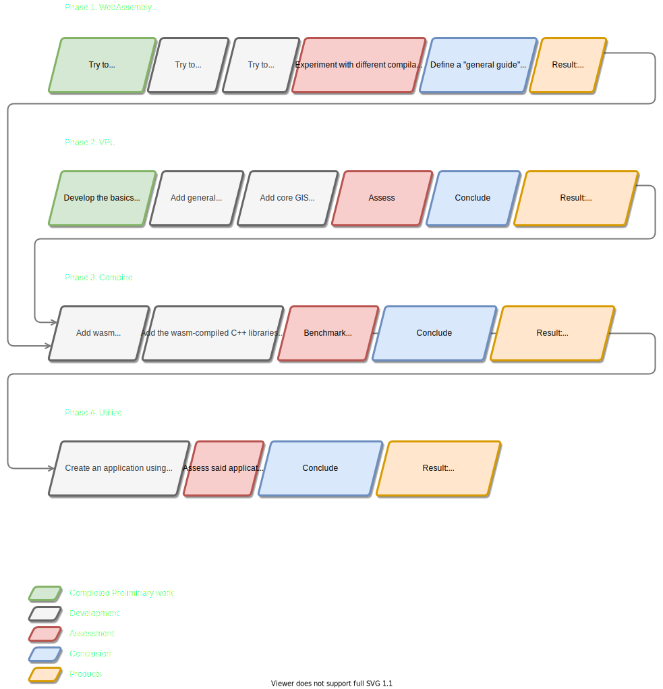

<!-- 

[ ------- FROM THE GEO2020 WEBSITE ------- ]

P2 template

The document for P2 is a research proposal that must contain:
- all the elements listed in the template available in the graduation manual (Appendix 2).
- You are free to write your project plan with the word processor of your choice (including LaTeX), as long as all the asked parts are present, in the same order. You can use that simple LaTeX template as starting point.
  - (LaTeX is strongly recommended tho...) [JF]: Ill try to use markdown for the time being. I think I will not need the advanced features of LaTeX (just yet). 
- We expect a project plan to be around 10-15 pages (maximum). 
- It should show that you clearly know the problem you plan to solve, 
- and that you master the related work. 
- We expect you to present the methodology you will use to solve your scientific problem(s), and to present preliminary results. 
- Also, this is a scientific proposal, so references are mandatory (even if there is no specific section in the template).

As an example, here’s a good project plan from a previous year. It contains:
    - an introduction in which the relevance of the project and its place in the context of geomatics is described, along with a clearly-defined problem statement;
    - a related work section in which the relevant literature is presented and linked to the project;
    - the research questions are clearly defined, along with the scope (ie what you will not be doing); to help you define a “good” research question, read this document
    - overview of the methodology to be used;
    - time planning—having a 'Gantt chart' is probably a better idea than just a list;
    - since specific data and tools have to be used, it’s good to present these concretely, so that the mentors know that you have a grasp of all aspects of the project;
    - the references.
'

[ ------ MY NOTES ------ ]

***NOTE: Whats remarkable about all the papers I've been reading, is how the best papers are often filled with diagrams. 
I must do the same, many abstract ideas are much easier to explain with small little diagrams.***

 -->

1.. INTRODUCTION
===============================================================================

> TODO: add sources, make it more professional. 

<!-- Social Impact -->

**I describe the main goal of the field of geomatics to be: *Give as many people as possible as much insight in their surroundings as possible.***
This is why we scan the earth, why we 'geo-process' these raw findings into more clean, meaningful forms, why we put these results in databases the size of dozens of terabytes, and why we build applications to view this data. All of it should be in the service of the general public, to give them the tools and data they need to gain meaningful information and insight into our surroundings. (SOUCE: MAYBE HUGO'S KEYNOTE?)

<!-- Geoprocessing is a core application of geographic information systems (GIS) and refers to the spatial analysis of data to derive information. [SOURCE: https://www.tandfonline.com/doi/full/10.1080/13658816.2016.1227441]-->

**The web plays a vital role in pursuing this goal.** The vast majority of geodata end-products are web applications (I NEED A SOURCE). this seems to stem from the web's excellent ability to publish cross-platform, and the fact that web-apps require no installation besides the browser. 

**This accessibility is improved by the "thin client fat server" design principle, prevalent in most geodata web applications (SOURCE: GEOWEB)**. This paradigm states that the server must handle complex procedures like geoprocessing and pre-rendering, and the clients remain as lightweight as possible. The big **advantage** of this paradigm is that client side applications remain small and thus easy to download. Additionally, a server side process can rely on fast, system level programming languages like C++, and powerful hardware. Both ensure speed and a level of reliability.  Client-side devices with low-end hardware can have access to powerful tools, far exceeding the processing capabilities of their own hardware. 

**However, not all web applications benefit from this paradigm.** 

<!-- 1 : expensive server bad  -->

- First of all, thin web applications depend on powerful, complex servers. The maintenance of this complexity, together with the acquisition and uptake costs of a performant server, drives up the costs of thin applications which require a unique backend. 

<!-- 2 : dependency bad -->

- Secondly, the fact that thin web applications do not just *utilize* a server, but *depend* on them to function normally, means that these applications will become less reliable. A strong internet connection is needed and must be maintained for the duration of the utilization of the app. This direct tie of the application to the corresponding server also raises privacy concerns. 

<!-- 3 : slow = bad -->

- Moreover, offloading processing to a server is not necessarily faster. In certain cases, the hardware improvements of client devices outperform a full round trip to a server carrying sizable geodata. 

<!-- 4 : large != bad -->
<!-- 

STATIC because: all options presented need to be pre-processed, pre-rendered, and stored in a server-side database. All possibilities granted to end-users will have to be thought about beforehand by the creators of the tool, and these possibilities are often limited since every additional option takes up vital database storage space. This leaves the user little room for experimentation, exploration, or personalization -->

And lastly, the discrepancy between visualization & processing in thin web applications makes these applications static, and thus inhibits their usefulness as sizable GIS applications. Not all applications desire to be small in scale. Many geo web applications desire to be insightful, and Insight is often more than just visualizing data. I pose that interaction and dynamic experimentation with geodata leads to a higher level of understanding into our geospatial surroundings. And, if the overarching goal of geomatics is to improve and **share** geospatial insight, then more accessible geoprocessing is a worthwhile pursuit.

<!-- The problem in one sentence: 
the discrepancy between visualization & processing in web-apps.
 -->

<!-- **Still, this hard divide between processing & visualization causes problems.** The thin-client web applications users are left with are static, non-interactive, and slow tools. 

- Static and non-interactive, because post-processing in a thin client is not possible. this means that all options presented need to be pre-processed, pre-rendered, and stored in a server-side database. All possibilities granted to end-users will have to be thought about beforehand by the creators of the tool, and these possibilities are often limited since every additional option takes up vital database storage space. This leaves the user little room for experimentation, exploration, or personalization. 

- And slow, since any type of off-site processing requires geodata to be trafficked across the web.  -->

<!-- - And slow, since any type of interaction between a thin client and corresponding thick server requires many steps:
  1. The server must be activated by the client by means of a web call. 
  2. It must posses of the exact same data the client is looking at. If this is not the case, it requires additional web calls to acquire this data. 
  3. The server can then perform the desired function. While this is happening, the client often has no insight in the progress of the server. Status updates can be given, but would yet again require more web traffic, especially when containing visualizations.
  4. After this is done, The server has to deliver all the resulting data back to the client using even more web-calls. -->

 

**These tradeoffs are why the opposite idea of a *thick* web client capable of client-side geoprocessing is gaining momentum** (SOURCE: PAPER I READ ABOUT HYBRID GEOPROCESSING, PAPER ABOUT THICK WEB CLIENTS IN GENERAL). If the tools used traditionally at the server-side, like the mature C++ geoprocessing libraries CGAL and GDAL, could be utilized client-side, the discrepancy between visualization & processing in most web-apps could be bridged. This would allow a new range of interactive, dynamic web applications, in which geodata can be post-processed quickly, uniquely, serverless, and on demand. 

<!-- Ties into a general JIT design philosophy -->

**However, client-side geoprocessing is held back by a serious problem.** Normally, only the `javascript` programming language can be utilized in client-side web applications. Previous attempts at client-side geoprocessing have shown that `javascript` based geoprocessing libraries are often not performant enough (SOURCE: BENCHMARK PAPER). Moreover, the javascript library ecosystem does not offer viable alternatives to libraries like CGAL & GDAL. This would mean that alternatives would have to be rewritten in javascript, or the source code would have to be compiled to javascript. 

<!-- often containing tens of thousands lines of code, -->

Both these solutions are imperfect. The first option would be a time-consuming task, and would have to be repeated every time the underlying libraries change. The second option is also a possibility. C++-based libraries such as CGAL can be converted to a special, fast subset of javascript called `asm.js` using the `emscripten` compiler [SOURCE: emscriptem]. This, however, can result in inefficiencies. The rather large javascript files usually take a long time to download, to scan, and to be properly optimized by a javascript Just In Time (JIT) Compiler [SOURCE: wasm]. 

 

**An emergent technology poses a third option.** WebAssembly, shortened as `wasm`, is a binary compilation target meant to be small, fast, save, and platform & source independent [SOURCE: wasm]. It outperforms `asm.js` in almost all aspects: it loads quicker, it is scanned quicker, and since it is far closer to bytecode than javascript, it can often perform at a speed comparable to its native counterpart [SOURCE: wasm, not-so-fast]. 

 

This development means that theoretically, there is not much preventing a wasm-powered client-side application to be almost as powerful as a server-side application. **The question remains, however, if this is also practically the case.** Several practical uncertainties remain, such as: 

- Do geoprocessing libraries directly compile into WebAssembly? If not, which workarounds are needed? 

- Will WebAssembly-compiled geoprocessing libraries (`wagl`'s), load efficiently, or should they be split up into parts, and loaded lazily? 

- Can the tools offered by `wagls` be directly used like functions? Or do they require special services, such as a virtual file system? 

- How well do `wagl` operations perform in a browser, compared to their native counterparts? What can be done to make this difference as small as possible?

 

Performing geoprocessing in a browser seriously transforms the nature of a geo-web application. This raises another set of questions, of a sightly different nature:

-  Instead of minimizing the responsibilities of a web-client application, what happens if we do the reverse and maximize the responsibilities? 

- What would a thick client look like?

- and what should a thick client be able to do?

- What should the user experience be?

Since no wasm-powered, client-side **geoprocessing** applications exist yet, there is no way to directly answer these questions, and no way to confirm the theoretical benefits of WebAssembly for the geospatial community.

   

### This Study

The aim of this study is to provide an environment meant for client-side geoprocessing using WebAssembly. This environment will be used to demonstrate if and how wasm-based, client-side geoprocessing is possible. At the same time, by presenting this environment, the study aims to explore the design possibilities of a web-GIS application equipped with such tools. 

This will require research into the technical effectiveness of WebAssembly. C++ geoprocessing libraries such as CGAL & GDAL will be tested on their ability to be compiled, loaded, and used from a browser. This is compared against their compilation by other means, such as native binaries or the aforementioned `asm.js`. This research is complemented by an extensive 'case study' to explore the design possibilities of a web-application equipped with client-side geoprocessing. A thick-client web application will be created, and this will serve as platform for testing the aforementioned `wagl`'s. The tool and can be additionally used for acquiring, visualizing, and saving geodata. 

(WebAssembly geoprocessing libraries -> `wagl`'s)

   

### Limits & Future Work

**Client-side WebAssembly Only**

This study will limit itself to the **client-side** usage of WebAssembly. A powerful case can be made for **server-side** usage of WebAssembly, especially in conjunction with a language like Rust. WebAssembly + Rust could, compared to using python, java or C++, make geoprocessing more maintainable and reliable, while at the same time ensuring memory safety, security, and performance [SOURCE: wasi, wasm-ai]. Server-side wasm is beyond the scope of this paper, but would be an excellent starting point for future work. 

Note that this also means that research into `wagl`'s is important for more than just client-side geoprocessing. All geoprocessing could benefit from it.

**No Surveys**

Additionally, a survey analyzing how users experience client-side geoprocessing in comparison to native geoprocessing must also be left to subsequent research. While this would gain us tremendous insight, client-side geoprocessing is insufficiently researched and developed to make a balanced comparison. Native environments like GRASSGIS, QGIS, FME or Esri simply have a 20+ year lead. This paper seeks to first close this gap, limiting itself to overcoming the technical and design boundaries in the pursuit of practical client-side geoprocessing. It seeks to present client-side geoprocessing as **an** option. Afterwards, Future research will have to be done to discover if this is **the** option (for a particular use case). 

<!-- 

, allowing a new range of interactive, dynamic web applications. 

hard divide between geo-processing tools only running locally on server-side is detrimental to the end-user

The goal is to remove the discrepancy between visualization & processing, allowing a new range of interactive, dynamic web applications.

It is time to extend the same level of distribution qualities pointed at geodata (FAIR-geodata) to geodata processing as well. 

-->

   

2.. BACKGROUND & RELATED WORK
===============================================================================

<!-- {DIAGRAM: DEPENDENCY TREE OF RELATED WORKS}

This section of the thesis proposal covers how this research relates to prior research. 

The execution of this research requires adequate background knowledge on:
- wasm itself 
- wasm performance
- Relevant wasm based applications
- wasm's surrounding tools and compilers

In addition, since the case study application contains the creation of a VPL, it is important to relate this work to other geometry-based visual programming languages, as well as a paper which analysed the advantages and disadvantages of using a VPL as opposed to a programming language.
 -->

   

## x.x On Client-side vs server-side geoprocessing 

### x.x.x 2014 Client-side versus Server-side Geoprocessing ...

*These results demonstrated that the current implementation of web browsers are limited in their ability to execute JavaScript geoprocessing and not yet prepared to process data sizes larger than about 7,000 to 10,000 vertices before either prompting an unresponsive script warning in the browser or potentially losing the interest of the user.*

This paper is very similar to what i'm doing, and it makes a conclusion that scared me at first glance. Then I saw that this is a paper out of 2014.

The results of this paper are insightful, but do not directly applicable to this paper because of three reasons: 
1. The paper used javascript-based geoprocessing, not `asm.js` optimized. This is known to be inefficient. 
2. The paper stems from 2014. is before an incredible industry-wide performance increase of javascript interpreters. 
   This is the result of technological development in the form of an arms race between the major browswer vendors. 
3. This paper will introduce WebAssembly to speed things up. 

   

### x.x.x Hybrid Geoprocessing Web Services

This paper proposes a hybrid strategy, using the OGC Web Processing services as a starting point, and building client-side tools around it. This is different from the approach offered by this study, which starts from the well-known CGAL and GDAL geoprocessing libraries. The environment proposed by this thesis might offer OGC Web Processing services, inspired by this paper. 

   

### x.x.x Analysis of server-side and client-side Web-GIS data processing methods on the example of JTS and JSTS using open data from OSM and geoportal

<!-- The last decade has seen a rapid evolution of processing, analysis and visualization of freely available geographic data using Open Source Web-GIS. In the beginning, Web-based Geographic Information Systems employed a thick-client approach which required installation of platform-specific browser plugins. Later on, research focus shifted to platform-independent thin client solutions in which data processing and analysis was performed by the server machine. More recently, however, the rapid development of computer hardware as well as software technologies such has HTML5 has enabled the creation of platform-independent thick clients which offer advanced GIS functionalities such as geoprocessing. This article aims to analyse the current state of Open Source technologies and publicly available geographic data sources in the context of creating cost-effective Web-GIS applications for integration and processing of spatial data. For this purpose the article discusses the availability and potential of Web-GIS architectures, software libraries and data sources. The analysis of freely available data sources includes a discussion of the quality and accuracy of crowd-sourced as well as public sector data, while the investigation of software libraries and architectures involves a comparison of server-side and client-side data processing performance under a set of real-world scenarios. The article concludes with a discussion of the choice of cost-effective Web-GIS architectures, software libraries and data sources in the context of the institution and environment of system deployment. -->

This is a very relevant source

   

## x.x On Fair 

An important side-note is the relationship of WebAssembly and the FAIR principles. The FAIR principles are a collection of four well-established assessment criteria used for judging the usability of software applications (SOURCE). They stand for Findable, Accessible, Interoperable, and Reusable. WebAssembly has the potential to improve all four of those criteria of a program:

WASM web apps: 
If an application is published on the web without login requirements, makes it so there is no delay between Findability and Accessibility. 
As soon as it can be found, it can be accessed. 

WASM containerized:
If the core logic of something is compiled into a wasm library, than this logic becomes Interoperable and Reusable. 
We can be sure that it will produce the same results, wherever it is run. 
Write once, use anywhere <-> Collect once, use multiple times

   

## x.x On Native tools with web-publishing support 

While many geodata processing tools such as FME and QGIS are integrating ways of web-publishing. 

This research proposes to reverse this reasoning. Instead of giving native applications tools to publish, it proposes to grant the most common distribution destination, the web, the tools needed to perform geodata processing. 

   

   

## x.x On WebAssembly & Wasm Performance

### x.x.x Website
https://webassembly.org/
(THE WEBSITE OF WASM ITSELF??)

### x.x.x Bringing the Web up to Speed with WebAssembly
This is the original paper introducing WebAssembly in 2017, co-written by software engineers from the major browser vendors Mozilla, Google, Apple and Microsoft. 
It defines that a low-level compilation target should be
save, fast, portable and compact.
It continues by showing how previous attempts at low-level code on the web fail in at least one of these criteria, and that WebAssembly is the first to delivers on all of them. 
The chapters following this up cover the design details of the language, and the decisions which had to be made to live up to the four criteria. 
These details will become relevant when reasoning about why WebAssembly might be faster in one case versus another.
<!-- proof of memory savety, proof of soundness  -->

<!-- EXPLORE TYPES & EFFICIENT LOADING OF DATA TYPES BETWEEN UNRELATED LIBRARIES -->

Chapter 6 and 7 also require special attention.
Chapter 6 shows the possibilities available to a host environment for compiling, instantiating and invoking wasm binaries. 

Chapter 7 : Implementation: 
- validate
- execution time
- binary size 

Initial benchmarks look promising
large portion of benchmarks within 10% 

<!-- 
Interoperability It is possible to link multiple modules that
have been created by different producers. However, as a low-
level language, WebAssembly does not provide any built-in
object model. It is up to producers to map their data types
to numbers or the memory. This design provides maximum
flexibility to producers, and unlike previous VMs, does not
privilege any specific programming or object model while
penalizing others. Though WebAssembly has a program-
ming language shape, it is an abstraction over hardware, not
over a programming language.
Interested producers can define common ABIs on top of
WebAssembly such that modules can interoperate in hetero-
geneous applications. This separation of concerns is vital for
making WebAssembly universal as a code format -->

### x.x.x Not So Fast WebAssembly Paper 
Paper exploring performance of WebAssembly more thorough.

Starts out positive: current benchmarks (2019) are even better than those of the original paper (2017). 

BUT 

Those original papers cover a type of benchmark which uses mainly scientific operations as benchmarks. 
Each of these operations are roughly 100 lines of code.
This paper created a way to compile full, large-scale applications into WebAssembly, and proceeds to benchmark them. 
They found that these types of applications run significantly slower and spikier.

BUT 

This might not be a problem for the scope of this research. 
This research will deal with the originally criticized scientific purposes anyway.
If it does turn out that wasm performs significantly slower the larger the binaries are, This research might explore disecting the C++ libraries into a number of tiny wasm Binaries, one per function for example, or per .cpp file. 
As stated in the Wasm paper (SOURCE), it is possible to inject precompiled wasm binaries within other wasm binaries. 
This way, the functionalities of one library could be lazy-initialized, so only the parts that are necessairy are being compiled and used. 
Food for thought...

...

A telling example of the cause of the loss in speed is this: 

NATIVE: 
C --{CLANG}-> x86-64 code

WEB
C --{EMSC}-> WASM --{JIT}-> x86-64 code 

+ Chapter 6 is very significant

<!-- 6.4 Discussion
It is worth asking if the performance issues identified here
are fundamental. We believe that two of the identified is-
sues are not: that is, they could be ameliorated by improved
implementations. WebAssembly implementations today use
register allocators (§6.1.2) and code generators (§6.2.1) that
perform worse than Clang’s counterparts. However, an offline
compiler like Clang can spend considerably more time to
generate better code, whereas WebAssembly compilers must
be fast enough to run online. Therefore, solutions adopted
by other JITs, such as further optimizing hot code, are likely
applicable here [19, 32].
The four other issues that we have identified appear to
USENIX Association 2019 USENIX Annual Technical Conference    117
arise from the design constraints of WebAssembly: the stack
overflow checks (§6.2.2), indirect call checks (§6.2.3), and
reserved registers (§6.1.1) have a runtime cost and lead to in-
creased code size (§6.3). Unfortunately, these checks are nec-
essary for WebAssembly’s safety guarantees. A redesigned
WebAssembly, with richer types for memory and function
pointers [23], might be able to perform some of these checks
at compile time, but that could complicate the implementa-
tion of compilers that produce WebAssembly. Finally, a Web-
Assembly implementation in a browser must interoperate with
a high-performance JavaScript implementation, which may
impose its own constraints. For example, current JavaScript
implementations reserve a few registers for their own use,
which increases register pressure on WebAssembly. -->

<!-- 
WHY PERFORMANCE LOST: LOST IN TRANSLATION 

NATIVE: 
C --{CLANG}-> x86-64 code

WEB
C --{EMSC}-> WASM --{JIT}-> x86-64 code 

Seems to be

 -->

<!-- 

TODO
look into the specifics of the benchmarks provided 
PolyBenchC seems to contain a lot of geometry operatinos, which seems good news for us

SIGNIFICANT FOR GEOMATICS: 
sync I/O is hard to do with webassembly. This could be detremental for many geomatics applciations

The standard approach to running these applications today
is to use Emscripten, a toolchain for compiling C and C++ to
WebAssembly [39]. Unfortunately, Emscripten only supports
the most trivial system calls and does not scale up to large-
scale applications. For example, to enable applications to use
synchronous I/O, the default Emscripten MEMFS filesystem
loads the entire filesystem image into memory before the
program begins executing. For SPEC, these files are too large
to fit into memory

 -->

   

## x.x On WebAssembly Applications:

### x.x.x Michael Yuan — Tensorflow inference on WebAssembly

_Michael Yuan — Tensorflow inference on WebAssembly_

_https://www.youtube.com/watch?v=poe0Z7GR8uI_

This talk by Dr. Michael Yuan explains the advantages of WebAssembly for especially the utilization (inference) of trained AI models. 
This is relevant, since the field of AI is, like the field of geo-informatics, concerned with complex calculations and the efficient processing of large datasets. 
Dr. Yuan states that, while python might be a fine choice for training AI models, the actual inference / usage of those models is very inefficient using contemporary tools. 
Python is very slow, does not run on edge devices, and offers limited support in (web) application frameworks. 
A native application ís fast, but offers different challenges. 
A native app is tied to its specific hardware platform, cannot be orchestrated, is very sensitive to bugs or attacks, is not save since it has OS-level access, and just like python, cannot easily be integrated in web or application frameworks.

The lecturer claims that WebAssembly solves these problems because it is containerized and thus save, while at the same time being very performant. Additionally, the fact that is is a language agnostic compile target, and can be used together with many (web) applications, makes it an excellent solution to the earlier mentioned problems.

this talk further supports the claims made that geodata processing would benefit from adopting WebAssembly. At the same time, it is mainly concerned with improving server side performance, which is outside the scope of this paper. 

<!-- 

related article 
https://www.secondstate.io/articles/why-webassembly-server/

related paper 
https://arxiv.org/abs/2010.07115

related company (supported by the linux foundation)
https://www.secondstate.io/ 

why relevant: 
this talk further supports the claims made that geodata processing would benefit from WebAssembly. 

notes:
- clearly states the advantages of something like wasm, and the philosophy behind it.
- focus on INFERENCE
  - Very important point to me as well: inference represents the operational step, what I started calling the "last mile problem".
- shows webassembly benefits to advanced computation use cases like machine learning. 

from the slides: 

- WebAssembly
  - high performance
  - sandbox safety
  - capability-based security 
  - language-agnostic
  - product-community fit
  
  - Better than native apps, because native apps ...
    - are not portable (Tied to specific OS or hardware platforms)
    - cannot be integrated into web or application frameworks 
    - cannot be managed or orchestrated
    - crashes from bugs & attacks 
    - unsafe: coursely grained, OS-level access control

  - Better than python, because python ...
    - 60.000x slower than C 
    - does not run on edge devices and platforms
    - limited support in web & application frameworks 
    -->

## x.x On Interactive Web Applications

### x.x.x VAT: A Scientific Toolbox for Interactive Geodata Exploration 

   

# x.x On advanced 3d web applications

<!-- SIDENOTE: This slowness problem will become more serious the more advanced web-applications become. Examples of this are 3D geo-web applications, applications reacting on incoming geodata in real-time (digital twins), and web-vr-applications. This becomes apparent when analyzing the design of Online video games. these applications usually make the clients calculate as much as possible, while making as little synchronization calls as possible. The more geo-web applications will start to resemble these types of video games, the more they will have to be programmed like one.  -->

## x.x Relevant WebAssembly Tools

### x.x.x Emscriptem
Emscriptem is a tool 
PAPERRRR

### x.x.x Wasm-Pack 
wasm-pack can be seen as the emscriptem equivalent, but created to serve the `Rust` programming language. 

NO PAPER

## x.x Relevant Geoprocessing libraries

### x.x.x CGAL 
(SOURCE)

### x.x.x GDAL 
...

   

## x.x VPL
The last topic requiring background knowledge is the topic of visual programming languages (VPL's). 

### x.x.x The relevant vpl paper

### x.x.x Related visual programming languages focussed on geometry:

What follows is a brief analysis of existing visual programming languages. While many more exist, such as Unity's Shader Graph, This list limits itself on vpl's meant for generating & processing geometry. 

| Name            | Author                | Availability       | Source    | Audience                     | Purpose              | Link                | Notes          
|---------------- | --------------------- | ------------------ | --------- | ---------------------------- | -------------------- | ------------------- | ----------
| FME             | Save Software         | €2,000 one time    | Closed    | Geoprocessing intermediaries | Geoprocessing        | https://www.safe.com/fme/fme-desktop/ | 
| The graphical modeller            | QGIS Contributors         | Free    | Open    | QGIS users | Geoprocessing        | https://www.safe.com/fme/fme-desktop/ | 
| Houdini         | SideFX                | ~€1,690 p.y.       | Closed    | 3D modellers & SFX           | Procedural Modelling & Special effects | https://www.sidefx.com/ |
| Geometry Nodes  | Blender Foundation & Contributors             | Free               | Open      | 3D modellers & SFX           | Procedural Modelling & Special effects | https://docs.blender.org/manual/en/latest/modeling/geometry_nodes/index.html   |
| Grasshopper     | David Rutten / McNeel | €995 one time      | Closed    | 3D modellers & architects    | Parametric Design    | https://docs.blender.org/manual/en/latest/modeling/geometry_nodes/index.html   |
| GeoFlow         | Ravi Peter            | Free               | Open      | Geoprocessing experts        | Geoprocessing: Rapid prototyping & Visualizing in between steps | https://github.com/geoflow3d/geoflow  |
| Dynamo          | Autodesk              | +revit €3,330 p.y. | Semi-open | Expert Revit Users           | BIM automation       | https://dynamobim.org/ | 

Of these seven vpl's, two are focussed on procedural design (Grasshopper / Dynamo), two are focussed on modelling in the context of special effects (Blender, Houdini), and three are focused on geo-processing (FME, Graphical Modeller). I would argue that while these goals differ, all of these vpls have a lot in common. All of them have some representation of vectors, points, line segments, polygons, surfaces and solids, in one way or another.

Their similarities end there. huge differences exist between them: 

- differences in availability. If they are not free (QGIS / Blender / Geoflow), these vpls are extremely expensive. this availability roughly correlates to the open / closed source nature of the packages. 

- differences in "usefulness". ... ...

   

3.. RESEARCH QUESTIONS
===============================================================================

How well does WebAssembly support client-side geoprocessing & GIS activities ?
OR
How can a client-side GIS web application using visual programming and WebAssembly be designed to ensure accessible, insightful, and usable geoprocessing?
OR

1 : What is the most effective methodology of compiling sizable C++ geoprocessing libraries to WebAssembly?
- effective: Minimum manual labour, Maximum performance, minimum load times.

2 : What should a web-vpl be capable of to classify itself as a GIS?
OR
2 : How should a GIS & web vpl be implemented?
OR
2 : How to make a web-based, client-side, vpl geoprocessing environment?

3 : How to integrate WebAssembly into the web-gis-vpl?
OR
3 : What is the performance penalty for using C++ geoprocessing libraries in WebAssembly versus native binaries?

4 : What are the advantages and disadvantages of GIS applications created using this web-gis-vpl environment?

> Do this again, this is old

## 3.1 Objectives

[DIAGRAM: TECHNICAL & PRACTICAL ASPECTS???]

This paper's main objective is to judge the fitness of WebAssembly for client-side geo-processing purposes. 
This fitness will be judged quantitatively by means of a performance analysis, as well as qualitatively by documenting the creation of a web-based geoprocessing application using WebAssembly. 

The main research question goes: 

> ***How well does WebAssembly support a client-side geoprocessing vpl?***

This question contains two main components: WebAssembly for geo-processing, and a visual programming language. It then asks how well the one supports the other. These components are reflected in the sub-questions: 

<!-- Create research questions that result in the desired answers:
"How can someone one do this?" is answered by showing how this was implemented
 -->

1. **GEO-WASM**: How well can C++ geoprocessing libraries such as CGAL & 3dfier be used within a web browser without needing to be installed, by using WebAssembly?
    - 2a: How well do WebAssembly compiled geoprocessing (geo-wasm) libraries perform compared to native, cli usage?
    - 2b: How to handle types / data models between multiple, unrelated `wasm` libraries?
    - 2c: How do C++ geoprocessing libraries differ from all other C++ libraries?
    - 2d: What does this difference mean for `wasm` compilation and usage? 

2. **GEO-WEB-VPL**: How to make a web-based, client-side, vpl geoprocessing environment?
    - 1a. **GEO**: What basic features does a geoprocessing environment need?
      <!-- - *answer: MOSKOW* -->
    - 1b. **WEB**: What advantages and limitations does a HTML5, CSS & JS based environment and interface give us?
      <!-- - *answer: Canvas, HTML as ui, webgl limitations, javascript as scripting, JIT compiler, etc* -->
    - 1c. **VPL**: What are the advantages and disadvantages of using a vpl?
      <!-- - *answer from the vpl papers*  -->

3. **GEO_WASM + GEO-WEB-VPL**: How well can geo-wasm libs be used within the context of a geo-web-vpl?
    - 3a: What data must a geo-wasm provide in order to become usable within a geo-web-vpl?
      <!-- - *answer: descriptors of operations and variables, how many inputs and outputs, etc.* -->
    - 3b: How can this data be utilized by the geo-web-vpl? 
      <!-- - " -->
    - 3c: How are the geo-wasm libraries distributed?
      <!-- - *answer: web service like npm or pip? Something like an app store?* -->
    

Some question I would like to answer: 

- Is there a difference between compiling the full CGAL / GDAL library into one binary and loading this in one go, versus compiling parts of it into several smaller binaries, which can be downloaded and loaded lazely?

## 3.2 Scope 

LIMITED TO:
- WebAssembly for web-usage 
- Geo-processing client-side

NOT:
- web processing services or server orchestration 
- WASI

<!-- 
(WebAssembly could be just a buzzword, a hype-based virus which hops from conference to conference. )
 -->

   

4.. MOTIVATION 
===============================================================================

## 4.1 'higher level' questions. 

The research questions chosen for this research are part of a set of larger questions. While the research will not completely answer the following questions, I believe the questions are nonetheless important to adress.

> What should the field of geomatics do with WebAssembly?
> - Why should the field of geomatics be interested? 
>   <!-- A: Yes  -->
> - Can we technically use it for geomatics? 
>   <!-- A: Probably  -->
> - Can we practically use if for geomatics? 
>   <!-- A: Unsure -->

This also further explains the need for the vpl application within this research. I believe it necessary to develop an application whom's existence serves as a starting point for answering the more complicated "why should we", and "practical" sub-questions.

   

## 4.2 Additional problems the software tries to solve, and features it tries to present:

additionally, 

### - Real-time geodata processing

- A number of use-cases exist with a growing need for real-time geodata processing. (SOURCE: INCIDENT MAPPER)

- Moving tools like CGAL closer to the final product (Web Application) can create more dynamic applications. 

### - Improved Geoprocessing Ergonomics

- Insightful debugging: Client-side geoprocessing together with a VPL allows direct user feedback unlike server-side geoprocessing. Users can be on top of the calculations, look at in betweens steps, reconfigure the procedure without recompilation, see the immediate effects of parameter changes. 

- Improved communications: Users will be able to share demo's and procedures with a link.

- Improved accessibility: Users will not have to install anything except a web-browser.
  This will make geoprocessing more accessible & operational to a larger audience. It allows more people to do more things with geodata, and reach more interesting conclusions quicker. 

### - Just In Time / Personal Geodata

- JIT: Instead of having large, preprocessed datasets, geodata could be processed on demand from the source client-side. If a user is only interested in a small area of the source dataset, this could save vast amounts of time, storage space and computational resources. 

- Personal: It also allows the end user to tailor geodata to their exact needs. 

   

5.. METHODOLOGY
===============================================================================

The study described by this proposal will be sizable, as well as complex. It contains many interlinked and interdependent components. As such, this study applies an incremental methodology with clear phases and in-between products, as a means of quality control while the study is carried out. It also eases the development process, as well as ensures sufficient results in the case the full scope of this study might become unfeasible. 

The four phases, based on the four sub-questions, are as follows: 

1. **Define** a procedure to successfully compile CGAL and GDAL to WebAssembly.
2. **Develop** a browser-based visual programming language (web-vpl), which can visualize geometry, and contains basic GIS functionalities.  
3. **Add** wasm support to this environment to use the wasm-compiled CGAL and GDAL libraries.
4. **Assess** the quality and functionality of said environment by using it to create geoprocessing applications. 

Every phase will be concluded by an answer to its corresponding research question. 

# phase 1 

The first phase will contrive of a number of steps:

- 1.1. Compile a small geoprocessing C++ script to wasm.
- 1.2  Compile CGAL & GDAL to wasm.
- 1.3  Comparison and discussion of multiple wasm compilation methods and considerations for large libraries.
- 1.4  Benchmark the CGAL & GDAL libraries native versus wasm.
      • Compiled and run as native binary (g++),
      • Compiled to wasm, run natively (WASI),
      • Compiled to wasm, run in a browser,
      • Compiled to asm.js, run natively (NODE.js),
      • Compiled to wasm, run in a browser.

(mention preliminary work with hugo, and the knowledge gained by using WebAssembly)

# phase 2 

The second phase is the development of the aforementioned web based visual programming language. This will be developed parallel to the first phase, informed by

...

At the end of this step, This environment will be usable 

basic mathematical and geometry procedures. 

and will not contain any geodata processing capabilities, nor WebAssembly. 

Just like the entire project, the development trajectory during phase 2 will be done incrementally, ensuring results can be produced and shown during all steps of the development. 

(mention preliminary work)
- 2D Canvas API / SVG 
- DAG : Directed Acyclic Graph
- Granular classes

# phase 3

The third phase 

# phase 4

Finally, the fourth phase is characterized by actually using and testing the developed environment.  

To provide 

## 5.3 Case Study

> ### *Demo Application: On Demand Triangulator + Isocurves* 
> 
> ### Input: 
> - Point Cloud
> 
> ### Output
> - Line Curves / .png render of line curves
> 
> ### Steps: 
> - Load ahn3 point-cloud (WFS Input Widget | WFS Preview Widget)
> - Visualize point cloud on top of base map of the netherlands (WMS Input Widget | WMS > Preview Widget)
> - Only select terrain points (list filter Operation)
> - Construct a 2d polygon by clicking points on a map (Polygon Input Widget)
> - Select Area of interest using a 2d polygon (Boundary Include Operation)
> - Triangulate point cloud with a certain resolution (Triangulate Operation)
> - Intersect the mesh surface with a series of planes (Isocurves from Mesh Operation)
> - Preview data (MultiLine Preview Widget)
> - Export data (MultiLine export Widget)

-------------------------------------------------------------------------------

old stuff 

(utilize pre-work)

## 5.1 Software

## 5.2 Tests

## 5.3 Design Case Study

A Visual Programming Language (VPL) will be created

## 5.3 Use Case Study

> ### *Demo Application: On Demand Triangulator + Isocurves* 
> 
> ### Input: 
> - Point Cloud
> 
> ### Output
> - Line Curves / .png render of line curves
> 
> ### Steps: 
> - Load ahn3 point-cloud (WFS Input Widget | WFS Preview Widget)
> - Visualize point cloud on top of base map of the netherlands (WMS Input Widget | WMS > Preview Widget)
> - Only select terrain points (list filter Operation)
> - Construct a 2d polygon by clicking points on a map (Polygon Input Widget)
> - Select Area of interest using a 2d polygon (Boundary Include Operation)
> - Triangulate point cloud with a certain resolution (Triangulate Operation)
> - Intersect the mesh surface with a series of planes (Isocurves from Mesh Operation)
> - Preview data (MultiLine Preview Widget)
> - Export data (MultiLine export Widget)

   

6.. PLANNING
===============================================================================

TODO
- write P2 presentation
- build the VPL
- apply VPL to Case Study
- build a similar application using python + jupyler, or some other conventional method
- perform tests and compare the two

   

7.. TOOLS USED
===============================================================================

Languages
  - WebAssembly
    - As compile target 

  - C++
    - 
  - Typescript / Javascript 
    - Front-end code
    - WebGl & javascript Canvas api
      - visualization 

  - Rust ????

Libraries & Tools 

- Emscriptem

- Wasm-Pack

- SSVM ???
  - : WebAssembly high performant virtual machine meant for server side

Data
  - WMS \& WFS services hosted by PDOK.
  - sample Geojsons from the geojson site 
