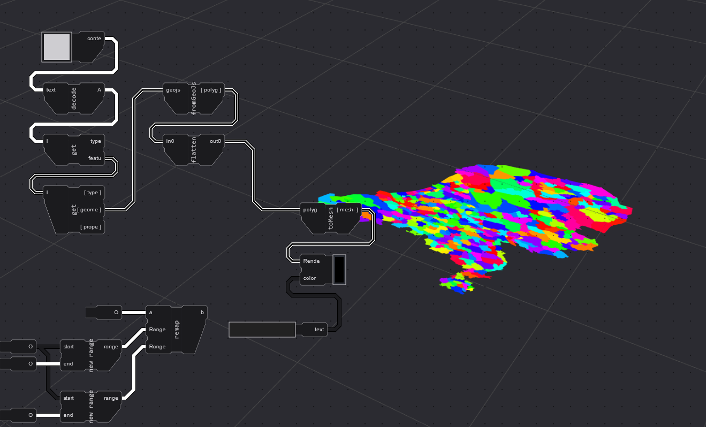
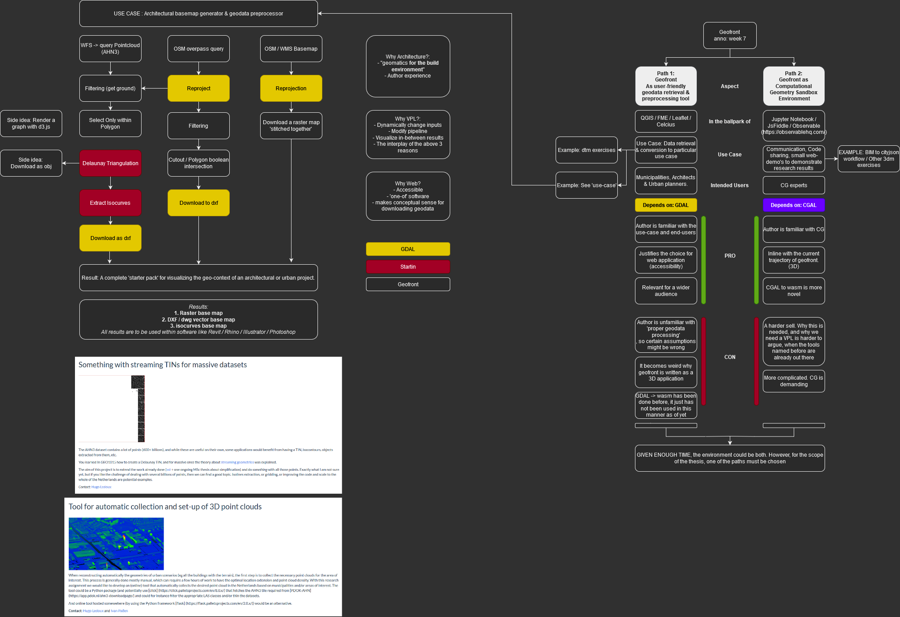

Sorry! I miss-scheduled! 

# meeting 3
|          |                         |
| -------- | ----------------------- |
| date     | 2022-03-~28~29 Tuesday (Sorry!)
| present  | Ken, Stelios, Jos
| Location | Faculty

# .1. Introduction

# .2. Results from last meeting
## - Geojson exploration

Succes! We can show (basic) geojsons, and we can even apply conditional formatting
Multiple things had to be created to make this succeed: 
- controllable iteration / looping tools 
- 'getters' to explore a json file 
- Finding and integrating a triangulator 
- Renderer which allows for conditional formatting
- Tools to allow contitional formatting, like 'conditions' themselves :)

A higher level-way of accessing a geojson will eventually be desired I think, but this works for now, and I think it is a nice feature that this tool is able to deal with raw data processing.

## - Geo-retrieval exploration

  - OSM Features
  - WMS Basemap 
## - Coming up with a use-case application 
## - Consider the CGAL / GDAL dichotomy 

- 

# .3. Discussion

# .4. For the next meeting

