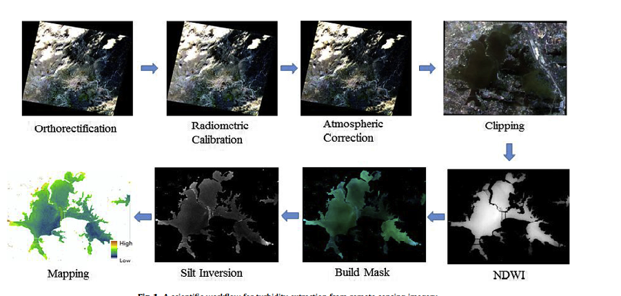

## very nice abstract
> from https://www.tandfonline.com/doi/full/10.1080/13658816.2016.1227441

Geoprocessing is a core application of geographic information systems (GIS) and refers to the spatial analysis of data to derive information. The construction of a spatial analysis workflow requires considerable expertise on the user side. The user has to translate the problem at hand into the necessary GIS operations and then prepare the required input data. Support provided by GIS tools during the composition of geoprocessing operations to workflows requires information about the data and operations on the system side. Current developments related to data and processing web services lead to an increased availability of tools for online analyses of spatial data. Leaving the bounds of established GIS upraises questions about the documentation required for the appropriate application of geoprocessing functionalities and for the support for users during workflow development.

## NOTE on 'a geoprocessing-workflow-system'
I'm fascinated by the sort of 'freudian slip visuals' like this one:

They use this diagram to explain the diagram they are trying to create. I think this **is** the diagram they should create. 

